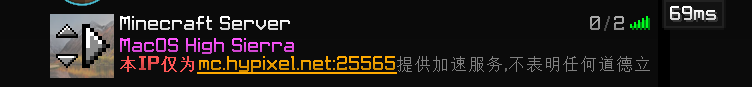

# 登录 | 使用

当管理员帮您注册并充值好后，您就可以登录HYP.RIP 控制台。

<figure><figcaption>
HYP.RIP 控制台登录页面
</figcaption></figure>

当您登录成功进入控制台，需要开启IP，请<mark style="color:red;">**点击一下**</mark>开启IP按钮之后<mark style="color:red;">**耐心等待**</mark>页面跳转开启成功。

之后会重新跳转到控制台主页面，并带有加速IP地址和实时解析地址。

之后您就可以通过添加控制台上的地址并连接来体验我们的Hypixel代理服务。

推荐使用实时解析地址。以防止未刷新DNS缓存导致得到安全警报。

<figure><figcaption></figcaption></figure>

<figure><figcaption>
HYP.RIP Proxy 服务器列表
</figcaption></figure>


请注意，不要多次点击开启或关闭IP按钮，这会使得服务器给你分配多台机器占用资源，而且会让其他玩家无法使用。我们将尽快修复这个Bug，如果我们发现你有恶意多次点击开启IP按钮的行为，我们会考虑给你一个禁令。如果你在使用中出现异常，请尽快联系我们处理。


当您游戏完毕，或者您在游戏中被封禁，需要关闭IP，请<mark style="color:red;">**单击**</mark>关闭IP按钮后，

<mark style="color:red;">**耐心等待**</mark>页面跳转关闭成功，之后会回到没有开启计费的控制台并扣除您的使用费用。

目前使用费用为0.54/小时(升级双线)

并会在重新开启IP时更换落地地址以防止您被Hypixel安全警报。

<figure><figcaption></figcaption></figure>


请保管好您的加速IP地址，泄露会使不法分子攻击服务器，造成的损失也会让部分玩家无法得到更好的游戏体验，而且我们也要承担攻击成本，所以请保管好您的加速IP地址。

