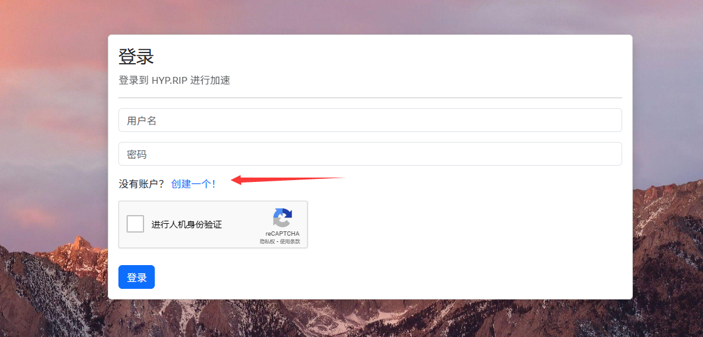
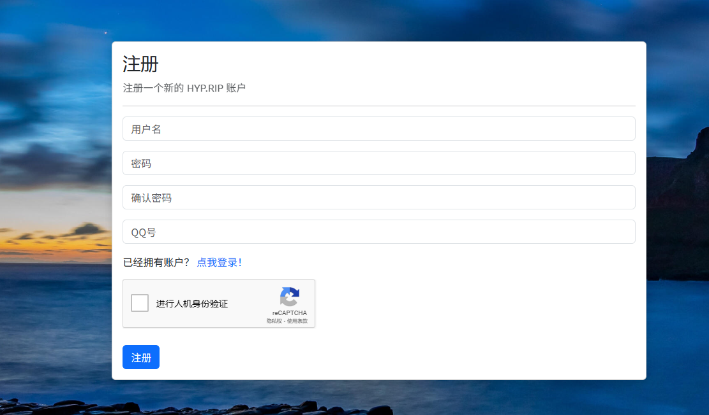
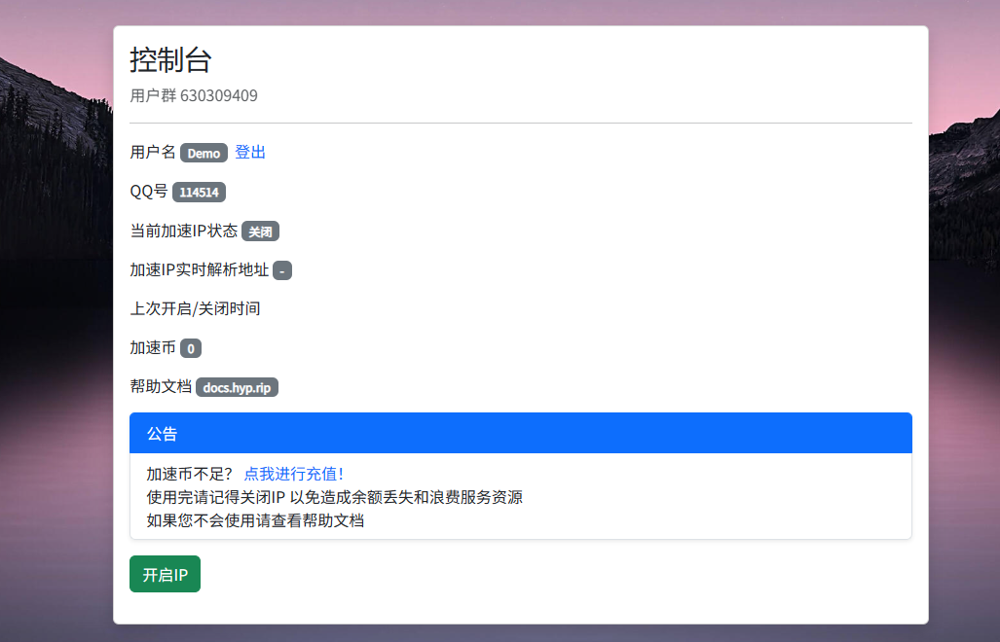
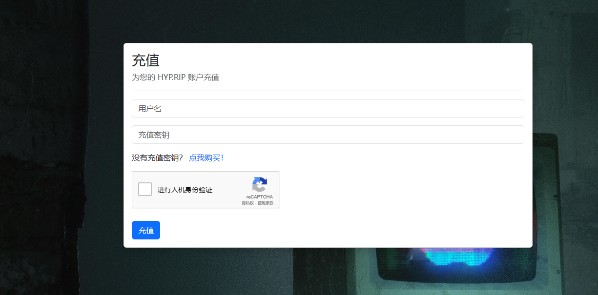
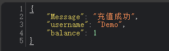

# 注册 | 充值

## 注册

如果您没有 HYP.RIP 账户，需要注册一个账户的话，请点击登录页面上的注册按钮进入注册页面。

<figure><figcaption>
登录页面
</figcaption></figure>

进入注册页面后，需要填写注册所需要的信息，请谨慎如实填写，以防忘记或丢失。

建议您保存或在纸上记录您的密码，密码会经过无法逆向的加密来保护您的账户。


请注意，您的用户名只能为大/小写字母和数字，如果您使用其他符号或特殊符号会注册失败。


<figure><figcaption>
注册页面
</figcaption></figure>

当您填写完注册信息，并点击注册按钮后，系统会跳转至注册成功页面。

显示注册成功后，等待几秒，您就会进入登录页面。这时候您就可以登录您刚刚注册的账户了。

<figure><figcaption>
注册成功页面
</figcaption></figure>

注册成功后，输入您刚刚注册的用户名和密码，您就能登录 HYP.RIP 加速控制台。

<figure><figcaption>
加速控制台页面
</figcaption></figure>

## 充值

您新注册，并进入控制台以后，您的加速币默认为0，是不能够使用加速服务的。

所以这个时候需要您给您的账户充值加速币，才能使用我们的加速服务。

如果您需要充值，请点击公告栏里的充值按钮。这时候会为您跳转到充值页面。

<figure><figcaption>
充值跳转按钮
</figcaption></figure>

在充值页面，充值需要您的用户名和充值密钥。充值密钥可以在官方购买或从其他经销商购买。

<figure><figcaption>
充值页面
</figcaption></figure>

当您充值成功后，系统会返回一段json (因为我没写通知😨)

会显示充值的用户名，和充值成功后的当前账户加速币余额。

这时候您就能返回控制台使用加速服务了。

<figure><figcaption>
充值成功信息
</figcaption></figure>
